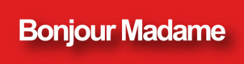

<br />
<div style="text-align: center;">
    
</div>
<br />

[bonjour_madame](https://pub.dev/bonjour_madame) is a library allowing to fetch data from the RSS feed of the french erotic website [Bonjour Madame](https://bonjourmadame.fr).

## Features

- Simple dart wrapper around the [Bonjour Madame](https://bonjourmadame.fr) rss feed
- Using the [http](https://pub.dev/http) package allowing to use it capacity to interface with native and/or custom http clients


## Getting started

Run 

```shell
dart pub add bonjour_madame
```

or add 

```yml
    bonjour_madame: ^1.0.0
```

to your `pubspec.yaml` and run 

```shell
dart pub get
```

## Usage

```dart
import 'dart:io';

import 'package:bonjour_madame/bonjour_madame.dart';
import 'package:http/http.dart';

/// This example fetch the last posted "madame"
void main() async {
  /// We're adding a custom User-Agent to the client
  final BonjourMadameClient bonjourMadameClient = BonjourMadameClient(
      defaultHeaders: {'User-Agent': 'BonjourMadameClient/1.0.0'});

  try {
    /// [mostRecent] is a custom shorthand in the library to get the first (last item add) to the feed
    final Post mostRecent = await bonjourMadameClient.posts.mostRecent;

    stdout.write('''
    __ Most recent "Bonjour Madame" Post __
    Title: ${mostRecent.title}
    Date: ${mostRecent.pubDate.toLocal()}
    Link: ${mostRecent.link}
    Image: ${mostRecent.image}
    ''');
  } on ClientException catch (cex) {
    stderr.writeln('Something went wrong : ${cex.message}');
    exit(-1);
  } on BonjourMadameException catch (bex) {
    stderr.writeln(
        'Server response is an error : ${bex.statusCode} ${bex.reasonPhrase}');
    exit(-1);
  }

  exit(0);
}
```

## Known limitations

- Only allow to access the current post into the rss feed, this is a design choice
- Don't automatically cache fetched post
- Doesn't allow from parsing a specific url to extract data (aka: scrapping)

## Additional information

### Legal

"Bonjour Madame", the logo, the icon are properties of https://bonjourmadame.fr team. They're only use here for illustration purposes.
This project, it's code or/and any aspect is affialiated nor endorsed by said team.


